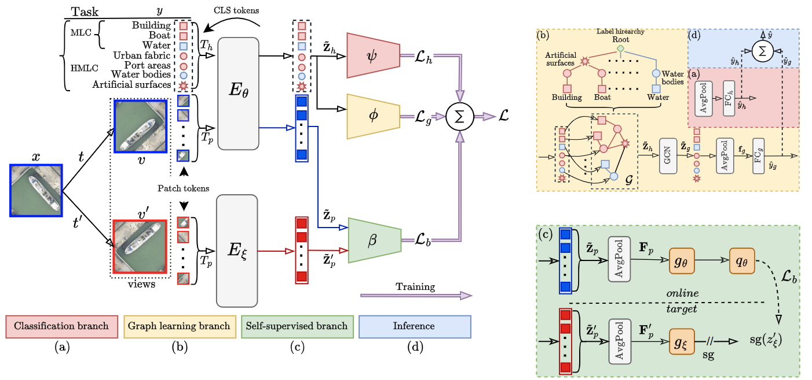
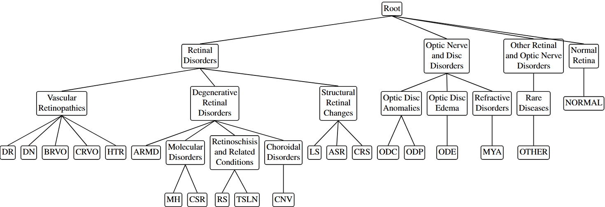

# HELM: Hierarchical and Explicit Label Modeling

[](LICENSE)

A clean, modular implementation of Hierarchical and Explicit Label Modeling using PyTorch Lightning and Pydantic configurations.

<p align="center">
  
</p>

<p align="center">
  <b>Overview of the HELM method.</b> The framework consists of a transformer encoder with hierarchy-specific tokens that interact with patch tokens to produce label-specific embeddings, used across three branches: <b>(a) classification branch</b>, which addresses the hierarchical multi-label classification (HMLC) task by flattening the hierarchy into a multi-label classification (MLC) problem; <b>(b) graph learning branch</b>, which propagates label dependencies using a Graph Convolutional Network (GCN); and <b>(c) the self-supervised branch</b>, which employs BYOL for learning feature representations from unlabeled data. The model integrates these components through a joint learning process by summing the losses from each branch to optimize the parameters.
</p>

## Features

- **Hierarchical Multi-Label Classification (HMLC)**: Leverage label hierarchies for improved classification
- **Graph Neural Networks**: SAGE, GCN, and GAT architectures for hierarchy-aware learning
- **Semi-Supervised Learning**: BYOL-based contrastive learning for unlabeled data
- **Flexible Configuration**: Hydra-based configuration system
- **Multi-Dataset Support**: Built-in support for remote sensing, fine-grained, and medical imaging datasets

## Installation

```bash
# Clone repository
git clone https://github.com/marjanstoimchev/HELM.git
cd HELM

# Create conda environment
conda create -n helm python=3.11
conda activate helm

# Install dependencies
pip install -r requirements.txt
```

### Requirements

- Python 3.11+
- PyTorch 2.0+
- PyTorch Lightning 2.0+
- torchmetrics
- hydra-core
- albumentations
- kornia
- torch-geometric
- timm
- datasets (HuggingFace)

## Quick Start

### 1. Supervised Training

```bash
# Train on DFC-15 with hierarchy and graph learning
python train.py dataset=dfc_15 training=graph_only

# Train on AID dataset (supervised baseline)
python train.py dataset=aid training=supervised_only
```

### 2. Semi-Supervised Training

```bash
# Train with BYOL (30% labeled)
python train.py dataset=aid training=byol_ssl training.labeled_ratio=0.3

# Full SSL: Classification + Graph + BYOL
python train.py dataset=dfc_15 training=full_ssl training.labeled_ratio=0.3

# Different labeled ratios
python train.py dataset=aid training=byol_ssl training.labeled_ratio=0.1  # 10% labeled
python train.py dataset=aid training=byol_ssl training.labeled_ratio=1.0  # 100% labeled
```

### 3. Multi-GPU Training

```bash
# Train on GPUs 0 and 1
CUDA_VISIBLE_DEVICES=0,1 python train.py dataset=aid training=full_ssl system.devices=2
```

## Hierarchy Encoding

HELM supports flexible hierarchy encoding from YAML configurations. Hierarchies can be derived from established medical nomenclatures (e.g., ICD-10 codes) or constructed using domain knowledge.

<p align="center">
  
</p>

<p align="center">
  <b>Example: MuRed Dataset Hierarchy.</b> The hierarchy is encoded in YAML format using ICD-10 codes as the foundation. For categories where direct mapping to established nomenclatures was not feasible, we employed a semi-automated approach combining LLM assistance (ChatGPT) with manual validation to ensure accurate hierarchical placements. This hybrid methodology enables HELM to learn from potentially noisy or incomplete hierarchies, making it robust to real-world medical datasets.
</p>

## Configuration

### Training Configurations

Located in `configs/training/`:

- `supervised_only.yaml`: Baseline classification only
- `graph_only.yaml`: Classification + Graph learning
- `byol_ssl.yaml`: Classification + BYOL (semi-supervised)
- `full_ssl.yaml`: Classification + Graph + BYOL (full SSL)

### Dataset Configurations

Located in `configs/dataset/`:

**Remote Sensing**:
- `dfc_15`: DFC-15 (8 classes)
- `aid`: AID (17 classes)
- `ucm`: UC Merced (17 classes)
- `mlrsnet`: MLRSNet (60)

**Fine-Grained**:
- `cub200`: CUB-200-2011 (birds)
- `stanford_cars`: Stanford Cars
- `oxford_pets`: Oxford-IIIT Pets

**Medical**:
- `chestxray8`: ChestX-ray8
- `padchest`: PadChest
- `ethec`: ETHEC
- `hpa`: Human Protein Atlas

## Repository Structure

```
HELM_Paper/
├── configs/
│   ├── config.yaml              # Main configuration
│   ├── dataset/                 # Dataset configs
│   │   └── hierarchies/         # Label hierarchies
│   └── training/                # Training configs
├── src/
│   ├── data/                    # Data loading and processing
│   │   ├── dataset/             # Dataset implementations
│   │   ├── hierarchies/         # Hierarchy utilities
│   │   └── ssl_dataset.py       # Semi-supervised dataset
│   ├── models/                  # Model architectures
│   │   ├── layers.py            # GNN layers (SAGE, GCN, GAT)
│   │   └── byol.py              # BYOL components
│   ├── training/                # Training modules
│   │   └── helm_module.py       # Main Lightning module
│   └── utils/                   # Utilities
├── train.py                     # Training script
├── extract_dataset.py           # Dataset extraction to CSV
├── test_ssl_integration.py      # SSL integration tests
└── README.md
```

## Training Options

### Loss Configuration

```yaml
loss:
  use_classification_loss: true
  use_graph_loss: true
  use_byol_loss: true

  classification_weight: 1.0
  graph_weight: 1.0
  byol_weight: 1.0
```

### Semi-Supervised Settings

```yaml
semi_supervised: true
labeled_ratio: 0.3          # Fraction of labeled data (0.0-1.0)
augmentation_strength: heavy
```

### System Configuration

```yaml
system:
  seed: 42
  precision: 16-mixed        # Options: 32, 16-mixed, bf16-mixed
  accelerator: gpu
  devices: 1                 # Number of GPUs
  check_val_every_n_epoch: 5 # Validation frequency
```

## Advanced Usage

### Custom Labeled Ratios

```bash
# 10% labeled (extreme low-data regime)
python train.py training=full_ssl training.labeled_ratio=0.1

# 50% labeled
python train.py training=full_ssl training.labeled_ratio=0.5
```

### Validation Frequency

```bash
# Validate every 5 epochs (faster training)
python train.py training=full_ssl system.check_val_every_n_epoch=5

# Validate every epoch
python train.py training=full_ssl system.check_val_every_n_epoch=1
```

### Custom Dataset Paths

```bash
# Specify custom data directory
python train.py dataset=dfc_15 dataset.data_dir=/path/to/dataset
```

## Dataset Extraction

Extract datasets to CSV format for external use:

```bash
# Extract DFC-15 dataset
python extract_dataset.py --dataset dfc_15 --output datasets/dfc_15.csv

# Extract AID dataset
python extract_dataset.py --dataset aid --output datasets/aid.csv
```

See `DATASET_EXTRACTION_GUIDE.md` for detailed documentation.

## Model Architecture

### Backbone

- DeiT (Data-efficient Image Transformer) base model
- Pre-trained on ImageNet
- 768-dimensional embeddings

### Classification Head

- Multi-label classification with BCE loss
- Supports both leaf-only (MLC) and full hierarchy (HMLC) modes

### Graph Module (Optional)

- SAGE (GraphSAGE): Neighborhood aggregation
- GCN (Graph Convolutional Network): Spectral convolutions
- GAT (Graph Attention Network): Attention-based aggregation

### BYOL Module (Optional)

- Bootstrap Your Own Latent (BYOL) for semi-supervised learning
- Weak and strong augmentations
- Momentum encoder with EMA updates
- Contrastive learning without negative pairs

## Monitoring Training

### TensorBoard

```bash
# Start TensorBoard
tensorboard --logdir outputs/

# View in browser
http://localhost:6006
```

### Metrics

- `train_loss`: Total training loss
- `train_loss_cls`: Classification loss
- `train_loss_graph`: Graph loss (if enabled)
- `train_loss_byol`: BYOL loss (if enabled)
- `train_f1`: F1-score (macro)
- `val_loss`: Validation loss
- `val_f1`: Validation F1-score

## Testing

Run integration tests:

```bash
# Test SSL integration
python test_ssl_integration.py
```

Expected output:
```
✅ TEST 1: Augmentation Pipelines - PASSED
✅ TEST 2: BYOL View Pairing - PASSED
✅ TEST 3: SSL Dataset Resampling - PASSED
✅ TEST 4: Complete Forward Pass - PASSED
```

## Authors of the paper
Marjan Stoimchev, Boshko Koloski, Jurica Levatić, Dragi Kocev, Sašo Džeroski

## License

This project is licensed under the MIT License - see LICENSE file for details.

## Acknowledgments

- BYOL implementation inspired by [lightly](https://github.com/lightly-ai/lightly)
- Graph neural networks powered by [PyTorch Geometric](https://pytorch-geometric.readthedocs.io/)
- Built with [PyTorch Lightning](https://lightning.ai/docs/pytorch/stable/)

